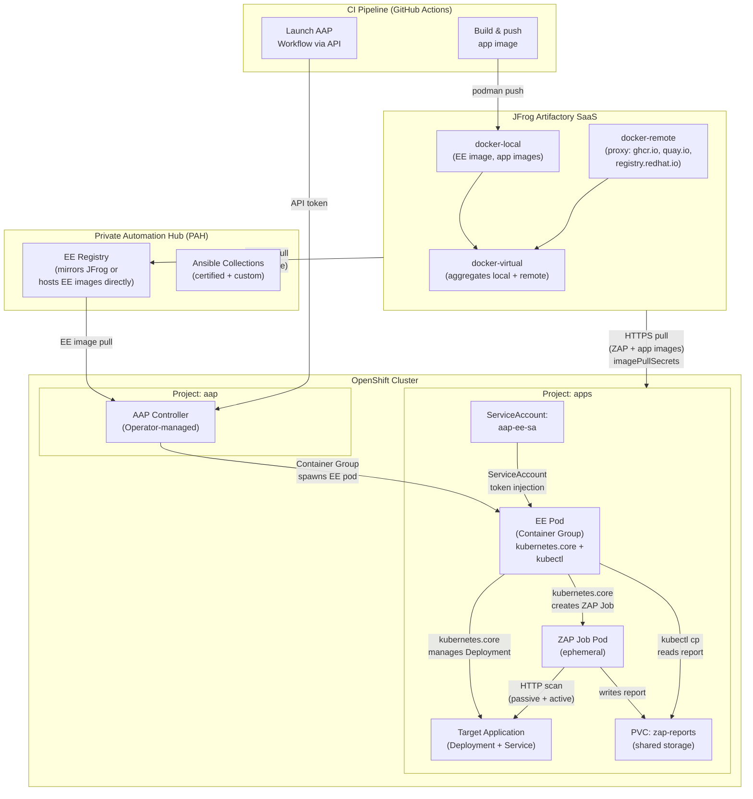
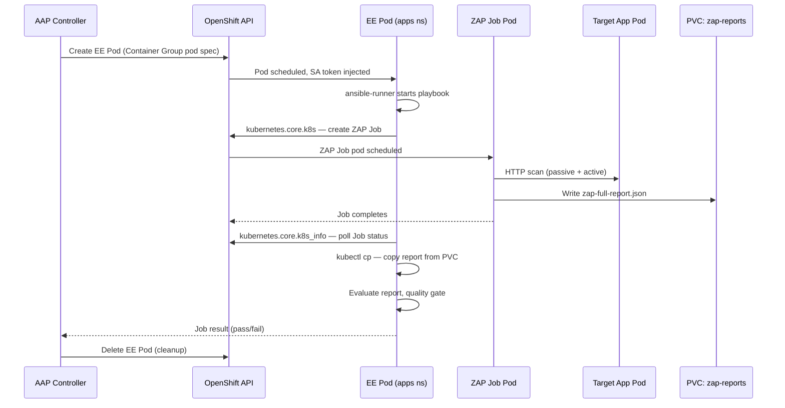
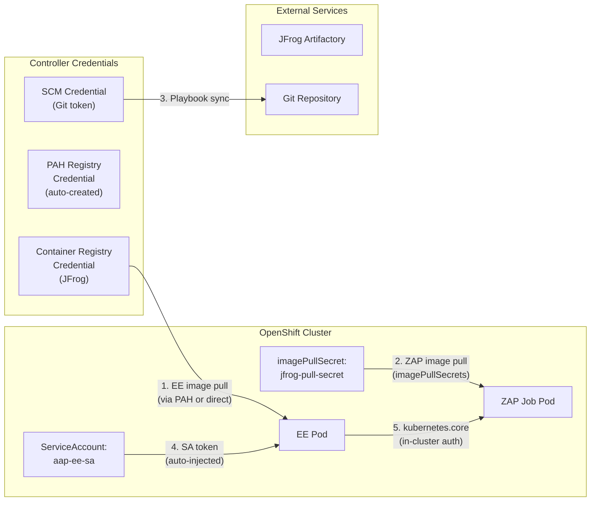
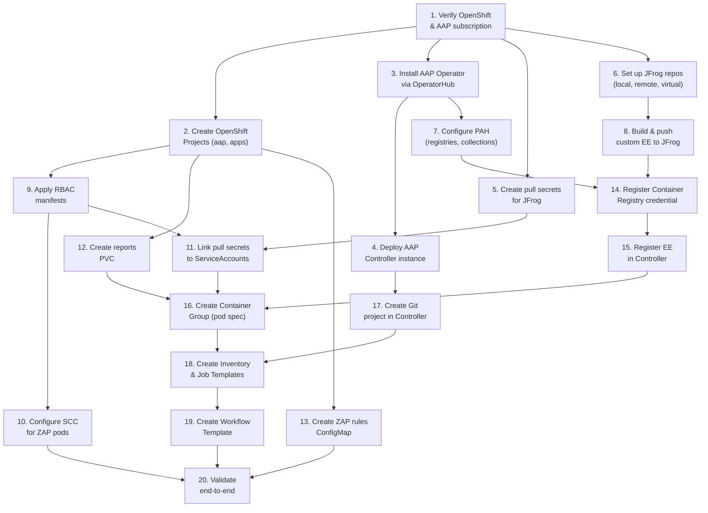

# ZAP-on-AAP Controller Production Setup — OpenShift Edition (JFrog Artifactory SaaS)

This guide covers the end-to-end setup for running OWASP ZAP DAST scans orchestrated by **Red Hat Ansible Automation Platform (AAP) Controller on OpenShift**, using JFrog Artifactory SaaS as the container registry. It documents every dependency, configuration step, and gotcha for a production deployment.

This is the **OpenShift/k8s-native edition**. The companion Podman edition (running AAP on RHEL with the containerized installer) uses a fundamentally different execution model — a Podman socket chain with `DEFAULT_CONTAINER_RUN_OPTIONS` and `AWX_ISOLATION_SHOW_PATHS`. This edition replaces all of that with **Container Groups**, **ServiceAccount RBAC**, **PVC-based report sharing**, and the `kubernetes.core` Ansible collection.

**Approach**: AAP Controller runs as an Operator on OpenShift. Execution Environment (EE) pods are launched in the cluster via a Container Group. The EE uses `kubernetes.core` with in-cluster ServiceAccount authentication to create ZAP scan Jobs and manage application deployments — no Podman socket, no `podman-remote`, no host bind mounts.

## Related Documents

- [01 — System Architecture](01-system-architecture.md)
- [02 — CI/CD Pipeline Flow](02-cicd-pipeline-flow.md)
- [03 — AWX Infrastructure](03-awx-infrastructure.md) — PoC Container Group, RBAC chain, EE internals
- [04 — Security Scanning](04-security-scanning.md) — scan flow, report format, quality gate

---

## 1. Architecture Overview



### Key Architectural Differences from the Podman Edition

| Aspect | Podman Edition (RHEL) | OpenShift Edition |
|--------|----------------------|-------------------|
| AAP installation | Containerized installer on RHEL (`setup.sh`) | AAP Operator via OperatorHub |
| EE execution | Podman container on RHEL host | Pod in OpenShift cluster (Container Group) |
| EE→container auth | Podman socket + `podman-remote` | ServiceAccount + RBAC (in-cluster) |
| Container runtime config | `DEFAULT_CONTAINER_RUN_OPTIONS` | Container Group pod spec override |
| Report sharing | `AWX_ISOLATION_SHOW_PATHS` (host bind mount) | PVC mounted in both EE and ZAP pods |
| ZAP execution | Podman containers via socket | Kubernetes Jobs (ephemeral pods) |
| Ansible collection | `containers.podman` | `kubernetes.core` |
| Networking | Host network + Podman bridge | Service DNS + OpenShift Routes |
| Privileged access | Podman socket = host-level control | RBAC scoped to namespace |

> **No Podman socket chain.** The entire socket-based authentication model (`podman.socket` → `DEFAULT_CONTAINER_RUN_OPTIONS` → `podman-remote` → `CONTAINER_HOST`) does not exist in this edition. The EE pod talks directly to the Kubernetes API using its injected ServiceAccount token.

---

## 2. Dependencies Checklist

### OpenShift Cluster

| Dependency | What It Provides | OOTB vs Custom |
|---|---|---|
| OpenShift 4.14+ | Container platform with Operator support | Subscription required |
| AAP Operator (OperatorHub) | Deploys and manages AAP Controller lifecycle | OOTB (install via OperatorHub) |
| OpenShift Projects (namespaces) | `aap` for Controller, `apps` for workloads | Custom (create) |
| Storage class (e.g., `gp3`, `thin`) | Dynamic PV provisioning for PVCs | OOTB (cloud/on-prem dependent) |
| Network route to target application | ZAP pods can reach the app under test via Service DNS | OOTB (cluster-internal) |
| Outbound HTTPS from cluster to JFrog | Image pulls via `imagePullSecrets` | Environment-specific |

### JFrog Artifactory SaaS

| Dependency | What It Provides | OOTB vs Custom |
|---|---|---|
| `docker-local` repository | Stores custom EE image, application images | Custom (create in JFrog) |
| `docker-remote` repository | Proxies ghcr.io (ZAP), quay.io (EE base), registry.redhat.io | Custom (create in JFrog) |
| `docker-virtual` repository | Single pull URL aggregating local + remote | Custom (create in JFrog) |
| Service account + API key or identity token | Authentication for pulls and pushes | Custom (create in JFrog) |
| TLS trust (JFrog CA in cluster trust) | Verified HTTPS connections | OOTB (public CA) |

### AAP Controller (Operator-based)

| Dependency | What It Provides | OOTB vs Custom |
|---|---|---|
| AAP Controller 4.x (via Operator) | Job orchestration, workflows, credentials, RBAC | OOTB (Operator-managed) |
| Container Group (Instance Group) | Runs EE pods in-cluster instead of on a RHEL host | Custom (configure in Controller) |
| Workflow templates | Chains Deploy → Scan → Evaluate | OOTB (feature) |
| Credential types (Container Registry, SCM) | Authenticates to registries and Git repos | OOTB (built-in types) |
| Project sync (SCM) | Pulls playbooks + rules from Git | OOTB (feature) |

### Private Automation Hub (PAH)

| Dependency | What It Provides | OOTB vs Custom |
|---|---|---|
| PAH instance (Operator or standalone) | EE image registry + certified collection distribution | OOTB (deployed with AAP Operator) |
| Collection sync (Red Hat Certified) | Pre-approved Ansible collections available to EEs | OOTB (configure sync) |
| Remote registry configuration in PAH | Mirrors JFrog for EE base images | Custom |

### Custom Execution Environment Image

| Dependency | What It Provides | OOTB vs Custom |
|---|---|---|
| Base image: `ee-minimal-rhel9:latest` | Supported Ansible runtime for AAP on OpenShift | OOTB (Red Hat provided) |
| `kubectl` | CLI for Kubernetes operations (used by `kubectl cp`) | Custom (installed in EE) |
| `kubernetes` Python package | Python client used by `kubernetes.core` collection | Custom (installed in EE) |
| `kubernetes.core` Ansible collection | Modules for k8s resource management (`k8s`, `k8s_info`) | Custom (installed in EE) |

Reference — the EE definition using `ansible-builder`:

**`execution-environment.yml`**:
```yaml
---
version: 3
images:
  base_image:
    name: registry.redhat.io/ansible-automation-platform-25/ee-minimal-rhel9:latest

dependencies:
  galaxy:
    collections:
      - name: kubernetes.core
  python:
    - kubernetes
  system:
    - kubectl [platform:rpm]

additional_build_steps:
  append_final:
    - RUN curl -LO "https://dl.k8s.io/release/$(curl -sL https://dl.k8s.io/release/stable.txt)/bin/linux/amd64/kubectl" \
          && install -o root -g root -m 0755 kubectl /usr/local/bin/kubectl \
          && rm kubectl
```

Build and push:
```bash
ansible-builder build \
  -f execution-environment.yml \
  -t yourcompany.jfrog.io/docker-local/aap-ee-zap:1.0.0

podman push yourcompany.jfrog.io/docker-local/aap-ee-zap:1.0.0
```

> **Note**: The PoC EE (`awx/Dockerfile.ee`) uses `quay.io/ansible/awx-ee:latest` as the base. For production AAP on OpenShift, use the Red Hat certified `ee-minimal-rhel9` base image built with `ansible-builder`. The PoC also works around a Python version mismatch (pip3 targets 3.11 while ansible-runner uses 3.9); the `ee-minimal-rhel9` base image does not have this issue.

### RBAC Manifests

| Dependency | What It Provides | OOTB vs Custom |
|---|---|---|
| ServiceAccount: `aap-ee-sa` | Identity for EE pods in `apps` namespace | Custom (see [Section 8](#8-rbac-detail)) |
| Role: `aap-ee-role` | Namespace-scoped permissions in `apps` | Custom |
| RoleBinding: `aap-ee-rolebinding` | Binds Role to ServiceAccount | Custom |
| ClusterRole: `aap-ee-namespace-manager` | Cluster-scoped namespace management | Custom |
| ClusterRoleBinding | Binds ClusterRole to ServiceAccount | Custom |
| RoleBinding: `aap-manage-apps` | Grants AAP Controller SA admin in `apps` Project | Custom |
| SCC (SecurityContextConstraints) | Allows ZAP pods to run as root (`runAsUser: 0`) | Custom |

### Playbooks & Rules

| Dependency | What It Provides | OOTB vs Custom |
|---|---|---|
| `ansible/playbooks/deploy.yml` | Deploys app via `kubernetes.core.k8s` | Custom |
| `ansible/playbooks/zap-scan.yml` | Creates ZAP scan k8s Jobs, copies reports via `kubectl cp` | Custom |
| `ansible/playbooks/evaluate-report.yml` | Parses ZAP JSON, enforces quality gate (`riskcode >= 3`) | Custom |
| `rules.tsv` (ConfigMap) | ZAP rule overrides (IGNORE/WARN/FAIL per rule ID) | Custom |

---

## 3. JFrog Artifactory SaaS Configuration

### Repository Structure

| Repository | Type | Purpose | Upstream |
|---|---|---|---|
| `docker-local` | Local | Custom EE image, application images | — |
| `docker-remote` | Remote | Proxy for upstream registries | `ghcr.io`, `quay.io`, `registry.redhat.io` |
| `docker-virtual` | Virtual | Single pull endpoint aggregating local + remote | `docker-local` + `docker-remote` |

> **Tip**: Add `registry.redhat.io` as a remote to cache the Red Hat EE base images and avoid registry rate limits.

### Image Reference Mapping

| Image | PoC Reference | Production Reference (JFrog) |
|---|---|---|
| Custom EE | `localhost:5000/awx-ee-k3s:latest` | `yourcompany.jfrog.io/docker-local/aap-ee-zap:1.0.0` |
| ZAP | `ghcr.io/zaproxy/zaproxy:stable` | `yourcompany.jfrog.io/docker-virtual/zaproxy/zaproxy:stable` |
| AAP EE base | `quay.io/ansible/awx-ee:latest` | `yourcompany.jfrog.io/docker-virtual/ansible-automation-platform-25/ee-minimal-rhel9:latest` |
| Sample app | `localhost:5000/sample-app:latest` | `yourcompany.jfrog.io/docker-local/sample-app:1.0.0` |

### OpenShift Pull Secrets

Unlike the Podman edition (where `podman login` creates a host-level `auth.json`), OpenShift uses **imagePullSecrets** attached to ServiceAccounts or referenced in pod specs:

```bash
# Create pull secret in the apps namespace
oc create secret docker-registry jfrog-pull-secret \
  --docker-server=yourcompany.jfrog.io \
  --docker-username=<service-account> \
  --docker-password=<api-key> \
  -n apps

# Link to ServiceAccount (all pods using this SA will use the secret)
oc secrets link aap-ee-sa jfrog-pull-secret --for=pull -n apps
oc secrets link default jfrog-pull-secret --for=pull -n apps
```

The Container Group pod spec can also reference the secret explicitly:

```yaml
spec:
  imagePullSecrets:
    - name: jfrog-pull-secret
```

### PAH as an Intermediate Registry

Private Automation Hub can act as an intermediate EE image registry between JFrog and the Controller:

**Option A — PAH mirrors JFrog**: Configure a remote registry in PAH pointing to `yourcompany.jfrog.io/docker-virtual/`. Controller pulls EE images from PAH, which caches from JFrog.

**Option B — JFrog direct**: Configure the Controller EE definition to pull directly from JFrog (bypassing PAH for images). PAH still serves Ansible collections.

**Option C — PAH as sole EE registry**: Push EE images directly to PAH's local container registry. No JFrog dependency for EE images.

### Credential Types

| Method | When to Use | How |
|---|---|---|
| Service account + API key | Automation (CI/CD, Controller, pull secrets) | Create service account in JFrog → generate API key → use as password |
| Identity token (OIDC) | Short-lived, federated auth | Configure OIDC provider in JFrog → use token-based pull secret |
| Access token | Scoped, auditable | Generate in JFrog UI → set expiration → use as password |
| Red Hat registry service account | Pulling base EE images from `registry.redhat.io` | Create at <https://access.redhat.com/terms-based-registry/> |

### What Changes from the PoC

- **No insecure registry**: JFrog SaaS uses HTTPS by default — remove `localhost:5000` references; use fully-qualified `yourcompany.jfrog.io/...` image names
- **imagePullSecrets replace `podman login`**: OpenShift pulls images via secrets attached to ServiceAccounts, not host-level auth.json
- **Single pull endpoint**: The `docker-virtual` repo provides one base URL for all images
- **Red Hat base image**: The EE base changes from `quay.io/ansible/awx-ee` to `registry.redhat.io/ansible-automation-platform-25/ee-minimal-rhel9` (supported, certified)

---

## 4. Step-by-Step Setup

### Step 1: Verify OpenShift Cluster and AAP Subscription

```bash
# Verify OpenShift version
oc version
# Expected: Client/Server Version 4.14+

# Verify AAP Operator is available in OperatorHub
oc get packagemanifests -n openshift-marketplace | grep ansible-automation-platform
```

### Step 2: Create OpenShift Projects

```bash
# Project for AAP Controller
oc new-project aap

# Project for application workloads and scanning
oc new-project apps
```

### Step 3: Install AAP Operator via OperatorHub

In the OpenShift web console:

1. Navigate to **Operators → OperatorHub**
2. Search for **Ansible Automation Platform**
3. Click **Install**
4. Select the `aap` namespace (or `openshift-operators` for cluster-wide)
5. Choose the appropriate update channel and approval strategy
6. Click **Install**

Verify the Operator is running:

```bash
oc get csv -n aap | grep ansible-automation-platform
# Expected: Succeeded
```

### Step 4: Deploy AAP Controller Instance

Create an AutomationController custom resource:

```yaml
apiVersion: automationcontroller.ansible.com/v1beta1
kind: AutomationController
metadata:
  name: aap-controller
  namespace: aap
spec:
  replicas: 1
  admin_user: admin
  admin_password_secret: aap-admin-password
  postgres_storage_class: <your-storage-class>  # e.g., gp3, thin
  route_tls_termination_type: Edge
```

```bash
# Create the admin password secret first
oc create secret generic aap-admin-password \
  --from-literal=password='<secure-password>' -n aap

# Apply the Controller CR
oc apply -f aap-controller.yaml

# Wait for the Controller to be ready
oc wait --for=condition=Running automationcontroller/aap-controller \
  --timeout=600s -n aap
```

Access the Controller via the auto-created Route:

```bash
oc get route -n aap
# Use the HTTPS URL to access the web UI
```

### Step 5: Create Pull Secrets for JFrog

```bash
# In the apps namespace (for ZAP image, app image pulls)
oc create secret docker-registry jfrog-pull-secret \
  --docker-server=yourcompany.jfrog.io \
  --docker-username=<service-account> \
  --docker-password=<api-key> \
  -n apps

# In the aap namespace (for EE image pulls, if pulling from JFrog directly)
oc create secret docker-registry jfrog-pull-secret \
  --docker-server=yourcompany.jfrog.io \
  --docker-username=<service-account> \
  --docker-password=<api-key> \
  -n aap
```

### Step 6: Set Up JFrog Repositories

In JFrog Artifactory UI or via REST API:

1. **Create `docker-local`**: Administration → Repositories → Local → Docker
2. **Create `docker-remote`**: Administration → Repositories → Remote → Docker
   - URL: `https://ghcr.io` (for ZAP), or `https://registry-1.docker.io`
   - Create additional remotes for `quay.io`, `registry.redhat.io` as needed
3. **Create `docker-virtual`**: Administration → Repositories → Virtual → Docker
   - Add `docker-local` and all `docker-remote` repos as included repositories
   - Set `docker-local` as the default deployment repository

### Step 7: Configure Private Automation Hub

In the PAH web UI:

1. **Add a remote registry** pointing to JFrog (if using PAH as EE image cache):
   - Execution Environments → Remote Registries → Add
   - Name: `JFrog Artifactory`
   - URL: `https://yourcompany.jfrog.io`
   - Username / Password: JFrog service account credentials

2. **Sync collections** from Red Hat Certified Content:
   - Collections → Repository Management → Remote → Configure
   - Sync `kubernetes.core` and any other needed collections

3. **Verify PAH credential in Controller**:
   - The AAP Operator auto-creates a PAH credential in the Controller
   - Verify at: Resources → Credentials → filter for "Automation Hub"

### Step 8: Build and Push Custom EE Image

```bash
# Authenticate to Red Hat registry (for base image)
podman login registry.redhat.io \
  --username <rh-service-account> \
  --password <rh-token>

# Build the EE image using ansible-builder
ansible-builder build \
  -f execution-environment.yml \
  -t yourcompany.jfrog.io/docker-local/aap-ee-zap:1.0.0

# Push to JFrog
podman push yourcompany.jfrog.io/docker-local/aap-ee-zap:1.0.0
```

### Step 9: Apply RBAC Manifests

These manifests are adapted from the PoC's `k8s/rbac/` directory. See [Section 8](#8-rbac-detail) for the full manifests and rationale.

```bash
# ServiceAccount for EE pods
oc apply -f - <<'EOF'
apiVersion: v1
kind: ServiceAccount
metadata:
  name: aap-ee-sa
  namespace: apps
EOF

# Role: namespace-scoped permissions in apps
oc apply -f - <<'EOF'
apiVersion: rbac.authorization.k8s.io/v1
kind: Role
metadata:
  name: aap-ee-role
  namespace: apps
rules:
  - apiGroups: [""]
    resources: [pods, pods/exec, pods/log, services, persistentvolumeclaims, configmaps]
    verbs: [get, list, watch, create, update, patch, delete]
  - apiGroups: ["apps"]
    resources: [deployments]
    verbs: [get, list, watch, create, update, patch, delete]
  - apiGroups: ["batch"]
    resources: [jobs]
    verbs: [get, list, watch, create, update, patch, delete]
EOF

# RoleBinding
oc apply -f - <<'EOF'
apiVersion: rbac.authorization.k8s.io/v1
kind: RoleBinding
metadata:
  name: aap-ee-rolebinding
  namespace: apps
subjects:
  - kind: ServiceAccount
    name: aap-ee-sa
    namespace: apps
roleRef:
  kind: Role
  name: aap-ee-role
  apiGroup: rbac.authorization.k8s.io
EOF

# ClusterRole: namespace management (cluster-scoped)
oc apply -f - <<'EOF'
apiVersion: rbac.authorization.k8s.io/v1
kind: ClusterRole
metadata:
  name: aap-ee-namespace-manager
rules:
  - apiGroups: [""]
    resources: [namespaces]
    verbs: [get, list, watch, create, update, patch]
EOF

# ClusterRoleBinding
oc apply -f - <<'EOF'
apiVersion: rbac.authorization.k8s.io/v1
kind: ClusterRoleBinding
metadata:
  name: aap-ee-namespace-manager
subjects:
  - kind: ServiceAccount
    name: aap-ee-sa
    namespace: apps
roleRef:
  kind: ClusterRole
  name: aap-ee-namespace-manager
  apiGroup: rbac.authorization.k8s.io
EOF

# Grant AAP Controller SA admin access in apps namespace
# (required for Container Group to create/manage EE pods)
oc apply -f - <<'EOF'
apiVersion: rbac.authorization.k8s.io/v1
kind: RoleBinding
metadata:
  name: aap-manage-apps
  namespace: apps
subjects:
  - kind: ServiceAccount
    name: aap-controller  # The SA created by the AAP Operator
    namespace: aap
roleRef:
  kind: ClusterRole
  name: admin
  apiGroup: rbac.authorization.k8s.io
EOF
```

### Step 10: Configure SCC for ZAP Pods

ZAP containers require `runAsUser: 0` (root). On OpenShift, this requires a SecurityContextConstraints (SCC) grant:

```bash
# Option A: Use the built-in 'anyuid' SCC
oc adm policy add-scc-to-user anyuid -z aap-ee-sa -n apps

# Option B: Create a dedicated SCC (principle of least privilege)
oc apply -f - <<'EOF'
apiVersion: security.openshift.io/v1
kind: SecurityContextConstraints
metadata:
  name: aap-zap-scc
allowHostDirVolumePlugin: false
allowHostIPC: false
allowHostNetwork: false
allowHostPID: false
allowHostPorts: false
allowPrivilegeEscalation: true
allowPrivilegedContainer: false
allowedCapabilities: null
fsGroup:
  type: RunAsAny
runAsUser:
  type: RunAsAny
seLinuxContext:
  type: MustRunAs
supplementalGroups:
  type: RunAsAny
volumes:
  - configMap
  - emptyDir
  - persistentVolumeClaim
  - projected
  - secret
EOF

oc adm policy add-scc-to-user aap-zap-scc -z aap-ee-sa -n apps
```

> **Why**: The PoC ZAP Job specs (`k8s/scanning/job-zap-*.yaml`) use `securityContext: runAsUser: 0`. OpenShift's default `restricted` SCC blocks this. The `anyuid` SCC (Option A) is simpler; a dedicated SCC (Option B) follows least privilege.

### Step 11: Link Pull Secrets to ServiceAccounts

```bash
# Link JFrog pull secret to the EE ServiceAccount
oc secrets link aap-ee-sa jfrog-pull-secret --for=pull -n apps

# Link to the default SA (used by ZAP Job pods if no SA specified)
oc secrets link default jfrog-pull-secret --for=pull -n apps
```

### Step 12: Create Reports PVC

```bash
oc apply -f - <<'EOF'
apiVersion: v1
kind: PersistentVolumeClaim
metadata:
  name: zap-reports
  namespace: apps
spec:
  accessModes:
    - ReadWriteOnce
  resources:
    requests:
      storage: 1Gi
EOF
```

> **Note**: The PoC uses `storageClassName: local-path` with `ReadWriteOnce` because k3s's local-path provisioner doesn't support `ReadWriteMany`. In production OpenShift, if multiple pods need concurrent access (e.g., parallel scans), use a `ReadWriteMany`-capable storage class (NFS, CephFS, etc.). For serial scan workflows (as in the PoC), `ReadWriteOnce` works fine since the EE pod and ZAP Job pods do not write simultaneously.

### Step 13: Create ZAP Rules ConfigMap

```bash
oc apply -f - <<'EOF'
apiVersion: v1
kind: ConfigMap
metadata:
  name: zap-rules
  namespace: apps
data:
  rules.tsv: |
    # ZAP Scan Rules Configuration
    # Format: <rule_id>	<action>	<name>
    # Actions: IGNORE, WARN, FAIL
    10003	WARN	Vulnerable JS Library
    10010	IGNORE	Cookie No HttpOnly Flag
    10011	IGNORE	Cookie Without Secure Flag
    10015	WARN	Re-examine Cache-control Directives
    10017	IGNORE	Cross-Domain JavaScript Source File Inclusion
    10019	WARN	Content-Type Header Missing
    10021	WARN	X-Content-Type-Options Header Missing
    10036	WARN	Server Leaks Version Information
    10038	WARN	Content Security Policy (CSP) Header Not Set
    10049	WARN	Storable and Cacheable Content
    10055	WARN	CSP: Wildcard Directive
    10096	WARN	Timestamp Disclosure
    10098	WARN	Cross-Domain Misconfiguration
EOF
```

### Step 14: Register Container Registry Credential in Controller

In Controller UI: Resources → Credentials → Add:

| Field | Value |
|---|---|
| Name | `JFrog Artifactory` |
| Credential Type | `Container Registry` |
| Authentication URL | `yourcompany.jfrog.io` |
| Username | `<service-account>` |
| Password | `<api-key>` |

This credential is used by the Controller to **pull the EE image** when launching Container Group pods (if pulling from JFrog directly, bypassing PAH).

### Step 15: Register Execution Environment in Controller

In Controller UI: Administration → Execution Environments → Add:

| Field | Value |
|---|---|
| Name | `ZAP Scanner EE` |
| Image | `yourcompany.jfrog.io/docker-local/aap-ee-zap:1.0.0` |
| Pull | `Always` (or `Missing`) |
| Registry Credential | `JFrog Artifactory` (from Step 14) or `Automation Hub Container Registry` |

### Step 16: Create Container Group in Controller

In Controller UI: Administration → Instance Groups → Add Container Group:

| Field | Value |
|---|---|
| Name | `OpenShift Container Group` |

Pod spec override:

```yaml
apiVersion: v1
kind: Pod
metadata:
  namespace: apps
spec:
  serviceAccountName: aap-ee-sa
  automountServiceAccountToken: true
  imagePullSecrets:
    - name: jfrog-pull-secret
  containers:
    - name: worker
      image: yourcompany.jfrog.io/docker-local/aap-ee-zap:1.0.0
      args:
        - ansible-runner
        - worker
        - --private-data-dir=/runner
      volumeMounts:
        - name: zap-reports
          mountPath: /reports
  volumes:
    - name: zap-reports
      persistentVolumeClaim:
        claimName: zap-reports
```

Key fields explained:

| Field | Purpose | PoC Equivalent |
|---|---|---|
| `namespace: apps` | EE pods run in `apps`, not `aap` | Same as PoC |
| `serviceAccountName: aap-ee-sa` | Provides k8s API access via RBAC | `awx-ee-sa` in PoC |
| `automountServiceAccountToken: true` | Injects SA token for `kubernetes.core` auto-detection | Same as PoC |
| `imagePullSecrets` | Authenticates image pulls from JFrog | Not needed in PoC (local registry) |
| `volumeMounts: /reports` | PVC mount for ZAP report sharing | Same as PoC |

> **Note**: This replaces `DEFAULT_CONTAINER_RUN_OPTIONS` from the Podman edition entirely. There is no socket mount, no `CONTAINER_HOST` env var, no `--network host`.

### Step 17: Create Git Project in Controller

In Controller UI: Resources → Projects → Add:

| Field | Value |
|---|---|
| Name | `ZAP Security Pipeline` |
| SCM Type | `Git` |
| SCM URL | `https://git.yourcompany.com/team/zap-pipeline.git` |
| SCM Branch | `main` |
| SCM Credential | *(Git credential if private repo)* |

The repository must contain:
- `ansible/playbooks/deploy.yml`
- `ansible/playbooks/zap-scan.yml`
- `ansible/playbooks/evaluate-report.yml`
- `k8s/scanning/configmap-rules.yaml`

### Step 18: Create Inventory and Job Templates

**Inventory** (Resources → Inventories → Add):

| Field | Value |
|---|---|
| Name | `DAST Scan Hosts` |
| Host | `localhost` |
| Host variables | `ansible_connection: local` |

**Deploy Job Template**:

| Field | Value |
|---|---|
| Name | `Deploy Sample App` |
| Inventory | `DAST Scan Hosts` |
| Project | `ZAP Security Pipeline` |
| Playbook | `ansible/playbooks/deploy.yml` |
| Execution Environment | `ZAP Scanner EE` |
| Instance Group | `OpenShift Container Group` |
| Extra Variables | `image_tag: latest` |

**ZAP Scan Job Template**:

| Field | Value |
|---|---|
| Name | `ZAP Security Scan` |
| Inventory | `DAST Scan Hosts` |
| Project | `ZAP Security Pipeline` |
| Playbook | `ansible/playbooks/zap-scan.yml` |
| Execution Environment | `ZAP Scanner EE` |
| Instance Group | `OpenShift Container Group` |
| Extra Variables | `reports_dir: /reports` |

**Evaluate Report Job Template**:

| Field | Value |
|---|---|
| Name | `Evaluate ZAP Report` |
| Inventory | `DAST Scan Hosts` |
| Project | `ZAP Security Pipeline` |
| Playbook | `ansible/playbooks/evaluate-report.yml` |
| Execution Environment | `ZAP Scanner EE` |
| Instance Group | `OpenShift Container Group` |
| Extra Variables | `reports_dir: /reports` |

> **Note**: `reports_dir: /reports` refers to the PVC mount path inside the EE pod, not a host path. This is fundamentally different from the Podman edition where `reports_dir` was a host-absolute path exposed via `AWX_ISOLATION_SHOW_PATHS`.

> **Note**: The Instance Group must be associated via a separate API call if using the REST API (not settable in the POST body). See PoC `scripts/awx-setup.sh` for the pattern: `POST /job_templates/{id}/instance_groups/`.

### Step 19: Create Workflow Template

In Controller UI: Resources → Templates → Add Workflow Template:

| Field | Value |
|---|---|
| Name | `CD Pipeline — Deploy, Scan, Evaluate` |

Add nodes:
1. **Node 1** (root): `Deploy Sample App` job template
2. **Node 2** (on success of Node 1): `ZAP Security Scan` job template
3. **Node 3** (on success of Node 2): `Evaluate ZAP Report` job template

### Step 20: Validate End-to-End

```bash
# Via Controller API (note: /api/controller/v2/ for AAP 2.5+)
curl -X POST \
  -H "Authorization: Bearer <controller-token>" \
  -H "Content-Type: application/json" \
  -d '{"extra_vars": {"image_tag": "1.0.0"}}' \
  https://<controller-route>/api/controller/v2/workflow_job_templates/<ID>/launch/
```

Verification checklist:
- [ ] EE pod starts in `apps` namespace (Container Group)
- [ ] EE image pulled from JFrog/PAH successfully
- [ ] Deploy playbook creates/updates Deployment and Service
- [ ] ZAP baseline Job pod starts with `runAsUser: 0` (SCC allows it)
- [ ] ZAP can reach `sample-app.apps.svc.cluster.local:8080` via Service DNS
- [ ] ZAP full scan Job completes
- [ ] Reports copied from PVC to `/reports` inside EE pod
- [ ] Evaluate job reads and parses the ZAP report
- [ ] Quality gate passes or fails as expected

---

## 5. Container Group Detail

The Container Group replaces the Podman socket chain from the Podman edition. Instead of mounting a host socket and using `podman-remote`, the EE runs as a pod in the cluster with native Kubernetes API access.

### EE Pod Lifecycle



### ServiceAccount Token Injection

When the EE pod starts with `automountServiceAccountToken: true`, Kubernetes injects:

| File | Content | Used By |
|---|---|---|
| `/var/run/secrets/kubernetes.io/serviceaccount/token` | JWT bearer token | `kubernetes.core` auto-detection |
| `/var/run/secrets/kubernetes.io/serviceaccount/ca.crt` | Cluster CA certificate | TLS verification |
| `/var/run/secrets/kubernetes.io/serviceaccount/namespace` | Current namespace (`apps`) | Namespace context |

The `kubernetes.core` collection automatically detects these files and configures the Kubernetes client — no kubeconfig file, no explicit credentials in playbooks, no environment variables. This is the "in-cluster config" pattern.

### PVC Report Sharing

Reports flow through a shared PVC instead of a host bind mount:

```
ZAP Job pod → writes to PVC (mountPath: /zap/wrk) → zap-full-report.json
EE pod → reads from PVC (mountPath: /reports) → kubectl cp or direct read
```

The PoC `zap-scan.yml` playbook creates a helper pod (`report-helper`) to extract reports from the PVC via `kubectl cp`. This pattern works because the PVC is `ReadWriteOnce` — only one pod can mount it read-write at a time. The playbook sequences: ZAP writes → ZAP completes → helper mounts → `kubectl cp` → helper deleted.

### Comparison with Podman Socket Chain

| Aspect | Podman Socket Chain | Container Group |
|--------|-------------------|-----------------|
| EE identity | Host Unix user (UID) | Kubernetes ServiceAccount |
| Auth propagation | Socket file permissions | RBAC (Role + RoleBinding) |
| Container creation | `podman-remote` → socket → host Podman | `kubernetes.core.k8s` → k8s API |
| Report sharing | Host bind mount (`AWX_ISOLATION_SHOW_PATHS`) | PVC mount in pod spec |
| Network model | Host network or Podman bridge | Cluster network (Service DNS) |
| Config surface | `DEFAULT_CONTAINER_RUN_OPTIONS` (list of flags) | Pod spec YAML override |
| Blast radius | Full host Podman access | Namespace-scoped RBAC |

---

## 6. Network Considerations

### ZAP → Target Application (Service DNS)

In the PoC and in OpenShift, ZAP reaches the target app via **Kubernetes Service DNS**:

```
http://sample-app.apps.svc.cluster.local:8080
```

This is the default `target_url` in the `zap-scan.yml` playbook. Both the ZAP Job pod and the target app run in the same `apps` namespace, so short-form DNS also works:

```
http://sample-app:8080
```

| Scenario | Target URL | Notes |
|---|---|---|
| Same namespace (PoC / production) | `http://sample-app.apps.svc.cluster.local:8080` | Standard k8s Service DNS |
| Cross-namespace | `http://sample-app.<other-ns>.svc.cluster.local:8080` | Requires NetworkPolicy allowing traffic |
| External app via Route | `https://app.yourcompany.com` | ZAP pod needs egress to the Route |

### Routes Instead of NodePort

The PoC uses `NodePort` to expose AWX (port 8043) and the sample app. In production OpenShift, use **Routes**:

```yaml
apiVersion: route.openshift.io/v1
kind: Route
metadata:
  name: sample-app
  namespace: apps
spec:
  to:
    kind: Service
    name: sample-app
  port:
    targetPort: 8080
  tls:
    termination: edge
```

AAP Controller automatically gets a Route created by the Operator. Access it via:

```bash
oc get route -n aap
```

### NetworkPolicy Recommendations

```yaml
apiVersion: networking.k8s.io/v1
kind: NetworkPolicy
metadata:
  name: allow-zap-to-app
  namespace: apps
spec:
  podSelector:
    matchLabels:
      app: sample-app
  ingress:
    - from:
        - podSelector:
            matchLabels:
              app: zap
      ports:
        - port: 8080
          protocol: TCP
```

### Firewall Rules

| Source | Destination | Port | Purpose |
|---|---|---|---|
| OpenShift nodes | `yourcompany.jfrog.io` | 443 | Image pulls (EE, ZAP, app) |
| OpenShift nodes | `registry.redhat.io` | 443 | EE base image pulls (Red Hat) |
| ZAP pod | Target app Service | App port (e.g., 8080) | DAST scanning (cluster-internal) |
| OpenShift nodes | Git server | 443 or 22 | Controller project sync |
| CI runners | AAP Controller Route | 443 | Workflow launch via API |
| Admins | AAP Controller Route | 443 | Web UI access |

---

## 7. Credential & Authentication Flow

The OpenShift edition has a **simpler credential model** than the Podman edition. There is no "dual-auth problem" (Controller credentials vs host Podman credentials) because everything runs in the cluster.



### Credential Summary

| What's Being Accessed | Who Accesses It | Credential Source |
|---|---|---|
| EE image (JFrog/PAH) | Controller (Container Group) | Controller Container Registry credential or PAH credential |
| ZAP image (JFrog) | OpenShift kubelet | `imagePullSecret` linked to ServiceAccount |
| App image (JFrog) | OpenShift kubelet | `imagePullSecret` linked to ServiceAccount |
| Kubernetes API | EE pod | ServiceAccount token (auto-injected) |
| Apps namespace resources | EE pod | RBAC (Role + RoleBinding for `aap-ee-sa`) |
| Namespace management | EE pod | RBAC (ClusterRole + ClusterRoleBinding) |
| Playbooks (Git) | Controller (project sync) | Controller SCM credential |
| Certified collections | PAH | Red Hat CDN credentials (configured in PAH) |
| AAP API (workflow launch) | CI pipeline | Controller API token (Bearer) |

### No Dual-Auth Problem

In the Podman edition, there were two separate auth paths:
- Controller credentials (for EE image pull)
- Host `auth.json` (for ZAP image pull via Podman socket)

These were completely disconnected, requiring separate `podman login` on the host.

In the OpenShift edition, **all image pulls go through OpenShift's kubelet**, authenticated via `imagePullSecrets` attached to ServiceAccounts. A single pull secret covers both EE and ZAP image pulls. No host-level `podman login` needed.

---

## 8. RBAC Detail

This section provides the complete RBAC manifests adapted from the PoC's `k8s/rbac/` directory, with production considerations.

### Full Manifest Reference

#### ServiceAccount

```yaml
apiVersion: v1
kind: ServiceAccount
metadata:
  name: aap-ee-sa
  namespace: apps
```

**PoC equivalent**: `k8s/rbac/serviceaccount.yaml` (name: `awx-ee-sa`)

#### Role (namespace-scoped)

```yaml
apiVersion: rbac.authorization.k8s.io/v1
kind: Role
metadata:
  name: aap-ee-role
  namespace: apps
rules:
  - apiGroups: [""]
    resources:
      - pods
      - pods/exec
      - pods/log
      - services
      - persistentvolumeclaims
      - configmaps
    verbs: [get, list, watch, create, update, patch, delete]
  - apiGroups: ["apps"]
    resources:
      - deployments
    verbs: [get, list, watch, create, update, patch, delete]
  - apiGroups: ["batch"]
    resources:
      - jobs
    verbs: [get, list, watch, create, update, patch, delete]
```

**PoC equivalent**: `k8s/rbac/role.yaml`

**Why each resource is needed**:

| Resource | Used By | Purpose |
|---|---|---|
| `pods`, `pods/exec`, `pods/log` | `zap-scan.yml` | Helper pod for `kubectl cp`, log viewing |
| `services` | `deploy.yml` | Create/update ClusterIP Service for app |
| `persistentvolumeclaims` | `zap-scan.yml` | Ensure ZAP reports PVC exists |
| `configmaps` | `zap-scan.yml` | ZAP rules ConfigMap |
| `deployments` | `deploy.yml` | Create/update app Deployment |
| `jobs` | `zap-scan.yml` | Create ZAP baseline and full scan Jobs |

#### RoleBinding

```yaml
apiVersion: rbac.authorization.k8s.io/v1
kind: RoleBinding
metadata:
  name: aap-ee-rolebinding
  namespace: apps
subjects:
  - kind: ServiceAccount
    name: aap-ee-sa
    namespace: apps
roleRef:
  kind: Role
  name: aap-ee-role
  apiGroup: rbac.authorization.k8s.io
```

**PoC equivalent**: `k8s/rbac/rolebinding.yaml`

#### ClusterRole (cluster-scoped)

```yaml
apiVersion: rbac.authorization.k8s.io/v1
kind: ClusterRole
metadata:
  name: aap-ee-namespace-manager
rules:
  - apiGroups: [""]
    resources: [namespaces]
    verbs: [get, list, watch, create, update, patch]
```

**PoC equivalent**: `k8s/rbac/clusterrole.yaml` (first document)

**Why cluster-scoped**: The `deploy.yml` playbook calls `kubernetes.core.k8s` to ensure the `apps` namespace exists. Namespaces are cluster-scoped resources — a namespace-scoped Role cannot manage them. The `delete` verb is intentionally omitted to prevent accidental namespace deletion.

#### ClusterRoleBinding

```yaml
apiVersion: rbac.authorization.k8s.io/v1
kind: ClusterRoleBinding
metadata:
  name: aap-ee-namespace-manager
subjects:
  - kind: ServiceAccount
    name: aap-ee-sa
    namespace: apps
roleRef:
  kind: ClusterRole
  name: aap-ee-namespace-manager
  apiGroup: rbac.authorization.k8s.io
```

**PoC equivalent**: `k8s/rbac/clusterrole.yaml` (second document)

#### Cross-Namespace RoleBinding (Controller → apps)

```yaml
apiVersion: rbac.authorization.k8s.io/v1
kind: RoleBinding
metadata:
  name: aap-manage-apps
  namespace: apps
subjects:
  - kind: ServiceAccount
    name: aap-controller  # Adjust to match your AAP Operator's SA name
    namespace: aap
roleRef:
  kind: ClusterRole
  name: admin
  apiGroup: rbac.authorization.k8s.io
```

**PoC equivalent**: `k8s/rbac/clusterrole.yaml` (third document, subject `awx` in namespace `awx`)

**Why**: The AAP Controller needs to create and manage EE pods in the `apps` namespace via the Container Group. Without this RoleBinding, the Container Group will fail with permission errors when spawning EE pods.

### Principle of Least Privilege Analysis

| Permission | Scope | Justification | Risk |
|---|---|---|---|
| `pods/*` in `apps` | Namespace | Helper pod for report extraction | Medium — can exec into any pod in `apps` |
| `deployments/*` in `apps` | Namespace | App deployment lifecycle | Low — scoped to `apps` only |
| `jobs/*` in `apps` | Namespace | ZAP scan Job creation | Low — batch workloads only |
| `namespaces` (get/create) | Cluster | Ensure namespace exists | Low — no delete verb |
| `admin` for Controller SA | Namespace (`apps`) | Container Group pod management | High — consider scoping down |

**Production hardening recommendations**:

1. **Scope down Controller SA permissions**: Replace `admin` with a custom Role that only allows pod/secret management in `apps` (what Container Group actually needs).
2. **Remove `pods/exec`** if `kubectl cp` is replaced with a PVC-based approach that doesn't need exec.
3. **Add `resourceNames`** to lock permissions to specific named resources where possible.
4. **Audit with `oc adm policy who-can`**: Verify actual permissions match intended.

### OpenShift SCC Considerations

OpenShift Security Context Constraints (SCCs) add an additional layer beyond standard Kubernetes RBAC:

| SCC | Effect | When Needed |
|---|---|---|
| `restricted` (default) | No root, no privilege escalation | Default for all pods |
| `anyuid` | Allows any UID (including root) | ZAP pods (`runAsUser: 0`) |
| Custom `aap-zap-scc` | Allows root but no host access | Production-recommended for ZAP |

> **Gotcha**: Even with correct RBAC, ZAP pods will fail with `Error: container has runAsNonRoot and image will run as root` if the SCC is not configured. RBAC and SCC are independent checks — both must pass.

---

## 9. Troubleshooting

| Symptom | Cause | Fix |
|---|---|---|
| EE pod stuck in `Pending` | Container Group SA lacks permission in `apps` namespace | Apply the `aap-manage-apps` RoleBinding (Step 9) |
| EE pod `ImagePullBackOff` | Missing or wrong `imagePullSecret` | Create `jfrog-pull-secret`, link to SA (Steps 5, 11) |
| ZAP pod `CreateContainerConfigError` or `CrashLoopBackOff` with SCC error | SCC blocks `runAsUser: 0` | Apply `anyuid` SCC or custom SCC to `aap-ee-sa` (Step 10) |
| ZAP pod `ImagePullBackOff` | Pull secret not linked to `default` SA in `apps` | `oc secrets link default jfrog-pull-secret --for=pull -n apps` |
| `kubernetes.core` module: `Forbidden` | RBAC Role missing required resource/verb | Check `oc auth can-i` for `aap-ee-sa`; update Role |
| `kubernetes.core` module: `Unauthorized` | SA token not injected | Verify `automountServiceAccountToken: true` in Container Group pod spec |
| PVC stuck in `Pending` | Storage class unavailable or wrong access mode | `oc describe pvc zap-reports -n apps`; verify storage class exists |
| Report not found by evaluate playbook | `reports_dir` mismatch or PVC not mounted | Ensure all JTs use `reports_dir: /reports`; verify PVC mount in Container Group pod spec |
| `kubectl cp` fails in EE pod | `kubectl` not installed in EE image | Verify EE Dockerfile installs kubectl |
| Python `ModuleNotFoundError: kubernetes` | `kubernetes` package installed for wrong Python version | Use `ansible-builder` with proper Python deps (see EE definition in Section 2) |
| Deploy playbook: `Forbidden` on namespaces | ClusterRole/ClusterRoleBinding not applied | Apply namespace-manager ClusterRole and ClusterRoleBinding (Step 9) |
| Container Group pod runs in wrong namespace | `namespace` not set in pod spec override | Add `metadata.namespace: apps` to Container Group pod spec |
| Controller can't create pods in `apps` | Controller SA lacks cross-namespace access | Apply `aap-manage-apps` RoleBinding granting Controller SA admin in `apps` |
| ZAP scan times out | Application not ready or `-m` timeout too low | Increase `-m` value in playbook; verify app readiness probe passes |
| API returns 404 on `/api/v2/` path | Using AWX/PoC API path on AAP Controller | Use `/api/controller/v2/` for AAP 2.5+ |
| Workflow launches but EE pod never appears | Instance Group not associated with Job Template | Associate Container Group via `POST /job_templates/{id}/instance_groups/` |
| EE pod `OOMKilled` | Default resource limits too low for ZAP scans | Add `resources.limits.memory` to Container Group pod spec |
| JFrog auth fails with `401` | Expired API key or wrong service account | Regenerate API key in JFrog; recreate `jfrog-pull-secret` |

---

## 10. Setup Sequence Diagram



---

## 11. OOTB vs Custom Summary

| Component | OOTB | Custom | Notes |
|---|---|---|---|
| OpenShift 4.14+ | Yes | — | Subscription required |
| AAP Operator (OperatorHub) | Yes | — | Installs and manages AAP Controller lifecycle |
| AAP Controller instance | Yes | — | Created via AutomationController CR |
| Private Automation Hub (PAH) | Yes | — | Deployed with AAP Operator |
| PAH auto-created credential | Yes | — | Controller ↔ PAH auth configured by Operator |
| Container Registry credential type | Yes | — | Built-in Controller credential type |
| Workflow Templates | Yes | — | Built-in Controller feature |
| Project sync (Git SCM) | Yes | — | Built-in SCM integration |
| Container Group (Instance Group type) | Yes | — | Built-in feature; requires custom pod spec |
| OpenShift Projects | — | Yes | Create `aap` and `apps` |
| JFrog Artifactory repos | — | Yes | Create docker-local, docker-remote, docker-virtual |
| JFrog service account + credentials | — | Yes | Create in JFrog for pull secrets |
| `imagePullSecrets` | — | Yes | Link to ServiceAccounts in `apps` namespace |
| Custom EE image | — | Yes | EE base + `kubectl` + `kubernetes` + `kubernetes.core` (via `ansible-builder`) |
| Container Group pod spec override | — | Yes | SA, PVC mount, imagePullSecrets, namespace |
| RBAC manifests (SA, Role, ClusterRole, Bindings) | — | Yes | Permissions for EE pods |
| SCC configuration | — | Yes | `anyuid` or custom SCC for ZAP root execution |
| PVC: `zap-reports` | — | Yes | Shared storage for ZAP reports |
| ConfigMap: `zap-rules` | — | Yes | ZAP rule overrides (IGNORE/WARN/FAIL) |
| `deploy.yml` playbook | — | Yes | App deployment via `kubernetes.core.k8s` |
| `zap-scan.yml` playbook | — | Yes | ZAP Job creation, report extraction via `kubectl cp` |
| `evaluate-report.yml` playbook | — | Yes | JSON parsing, quality gate logic |
| Job Templates (Deploy, Scan, Evaluate) | — | Yes | Playbook + inventory + extra_vars + Container Group |
| Workflow Template | — | Yes | Node chain: Deploy → Scan → Evaluate |

---

## Appendix A: PoC-to-Production Mapping

| PoC File | PoC Purpose | Production Equivalent |
|---|---|---|
| `scripts/setup-k3s.sh` | Install k3s | OpenShift cluster provisioning (IPI/UPI) |
| `scripts/deploy-awx.sh` | AWX Operator + instance via Kustomize | AAP Operator via OperatorHub + AutomationController CR |
| `scripts/awx-setup.sh` | Configure AWX resources via REST API | Controller UI or API setup (same pattern, different API path) |
| `scripts/start.sh` | Build/push app, create namespaces, deploy | CI pipeline (GitHub Actions) + AAP Workflow |
| `scripts/run-pipeline.sh` | Full pipeline orchestration | AAP Workflow Template (Deploy → Scan → Evaluate) |
| `awx/Dockerfile.ee` | Custom EE with kubectl + kubernetes.core | `ansible-builder` with `execution-environment.yml` using `ee-minimal-rhel9` base |
| `awx/kustomize/awx-instance.yaml` | AWX CR (NodePort, local-path) | AutomationController CR (Route, production storage class) |
| `k8s/rbac/serviceaccount.yaml` | `awx-ee-sa` in `apps` | `aap-ee-sa` in `apps` (same pattern) |
| `k8s/rbac/role.yaml` | `awx-ee-role` in `apps` | `aap-ee-role` in `apps` (same rules) |
| `k8s/rbac/rolebinding.yaml` | Binds role to `awx-ee-sa` | Binds role to `aap-ee-sa` (same pattern) |
| `k8s/rbac/clusterrole.yaml` | Namespace manager + AWX cross-ns binding | Namespace manager + AAP Controller cross-ns binding |
| `k8s/scanning/pvc-reports.yaml` | `zap-reports` PVC (local-path, RWO) | `zap-reports` PVC (production storage class, RWO or RWX) |
| `k8s/scanning/configmap-rules.yaml` | ZAP rules ConfigMap | Same ConfigMap (adjust rules per org policy) |
| `k8s/scanning/job-zap-baseline.yaml` | ZAP baseline Job spec | Created dynamically by `zap-scan.yml` (same spec) |
| `k8s/scanning/job-zap-full.yaml` | ZAP full scan Job spec | Created dynamically by `zap-scan.yml` (same spec) |
| `ansible/playbooks/deploy.yml` | Deploy app via `kubernetes.core.k8s` | Same playbook (update `image_name` to JFrog reference) |
| `ansible/playbooks/zap-scan.yml` | ZAP Jobs + report extraction | Same playbook (update `zap_image` to JFrog reference) |
| `ansible/playbooks/evaluate-report.yml` | Quality gate (riskcode >= 3) | Same playbook (no changes needed) |
| `docs/03-awx-infrastructure.md` | PoC Container Group + RBAC docs | This document (production-adapted) |
| `.github/workflows/ci.yml` | CI pipeline (podman build + pipeline) | CI pipeline (podman/buildah build + push to JFrog + AAP API trigger) |

---

## Appendix B: Terminology

| Podman Edition Term | OpenShift Edition Equivalent | Notes |
|---|---|---|
| RHEL host | OpenShift cluster | Execution moves from a single host to a cluster |
| Podman socket (`podman.socket`) | Kubernetes API server | The control plane endpoint for container management |
| `podman-remote` | `kubernetes.core` + `kubectl` | CLI/module for managing containers |
| `DEFAULT_CONTAINER_RUN_OPTIONS` | Container Group pod spec override | How EE container configuration is defined |
| `AWX_ISOLATION_SHOW_PATHS` | PVC volumeMount in pod spec | How reports are shared with EE |
| Host bind mount | PersistentVolumeClaim (PVC) | Storage mechanism for reports |
| `containers.podman` collection | `kubernetes.core` collection | Ansible modules for container/k8s management |
| Podman bridge network | Kubernetes Service + ClusterIP | Intra-cluster container networking |
| `--network host` | Service DNS (`svc.cluster.local`) | How ZAP reaches the target app |
| Host `auth.json` (`podman login`) | `imagePullSecret` (OpenShift Secret) | Container registry authentication |
| Containerized installer (`setup.sh`) | AAP Operator (OperatorHub) | AAP installation mechanism |
| `/opt/aap/reports/` (host path) | `/reports` (PVC mount) | Report directory inside EE |
| `systemctl --user podman.socket` | ServiceAccount + RBAC | Authentication and authorization model |
| Root vs rootless Podman | SCC (SecurityContextConstraints) | Privilege control mechanism |
| `/api/v2/` (AWX API path) | `/api/controller/v2/` (AAP API path) | REST API base path |
| NodePort (PoC) | Route (OpenShift) | External access to services |

---

## Appendix C: Official Documentation

### Red Hat Ansible Automation Platform

| Resource | URL |
|---|---|
| AAP 2.5 documentation | <https://docs.redhat.com/en/documentation/red_hat_ansible_automation_platform/2.5> |
| AAP on OpenShift installation | <https://docs.redhat.com/en/documentation/red_hat_ansible_automation_platform/2.5/html/installing_ansible_automation_platform_on_openshift_container_platform> |
| Automation Controller user guide | <https://docs.redhat.com/en/documentation/red_hat_ansible_automation_platform/2.5/html/using_automation_execution> |
| Automation Controller admin guide | <https://docs.redhat.com/en/documentation/red_hat_ansible_automation_platform/2.5/html/automation_controller_administration_guide> |
| Execution Environments guide | <https://docs.redhat.com/en/documentation/red_hat_ansible_automation_platform/2.5/html/creating_and_consuming_execution_environments> |
| Private Automation Hub guide | <https://docs.redhat.com/en/documentation/red_hat_ansible_automation_platform/2.5/html/managing_automation_content> |
| `ansible-builder` (EE build tool) | <https://ansible.readthedocs.io/projects/builder/en/latest/> |

### OpenShift

| Resource | URL |
|---|---|
| OpenShift 4.x documentation | <https://docs.openshift.com/container-platform/latest/welcome/index.html> |
| RBAC (Role-Based Access Control) | <https://docs.openshift.com/container-platform/latest/authentication/using-rbac.html> |
| SecurityContextConstraints (SCC) | <https://docs.openshift.com/container-platform/latest/authentication/managing-security-context-constraints.html> |
| Routes | <https://docs.openshift.com/container-platform/latest/networking/routes/route-configuration.html> |
| ImagePullSecrets | <https://docs.openshift.com/container-platform/latest/openshift_images/managing_images/using-image-pull-secrets.html> |
| NetworkPolicy | <https://docs.openshift.com/container-platform/latest/networking/network_policy/about-network-policy.html> |
| PersistentVolumeClaims | <https://docs.openshift.com/container-platform/latest/storage/understanding-persistent-storage.html> |

### kubernetes.core Ansible Collection

| Resource | URL |
|---|---|
| Galaxy page | <https://galaxy.ansible.com/ui/repo/published/kubernetes/core/> |
| GitHub repository | <https://github.com/ansible-collections/kubernetes.core> |
| Module index | <https://docs.ansible.com/ansible/latest/collections/kubernetes/core/index.html> |
| `k8s` module | <https://docs.ansible.com/ansible/latest/collections/kubernetes/core/k8s_module.html> |
| `k8s_info` module | <https://docs.ansible.com/ansible/latest/collections/kubernetes/core/k8s_info_module.html> |

### OWASP ZAP

| Resource | URL |
|---|---|
| ZAP project homepage | <https://www.zaproxy.org/> |
| ZAP Docker documentation | <https://www.zaproxy.org/docs/docker/about/> |
| Baseline scan | <https://www.zaproxy.org/docs/docker/baseline-scan/> |
| Full scan | <https://www.zaproxy.org/docs/docker/full-scan/> |
| ZAP container images (GHCR) | <https://github.com/zaproxy/zaproxy/pkgs/container/zaproxy> |

### JFrog Artifactory

| Resource | URL |
|---|---|
| Artifactory documentation | <https://jfrog.com/help/r/jfrog-artifactory-documentation> |
| Docker registry setup | <https://jfrog.com/help/r/jfrog-artifactory-documentation/docker-registry> |
| Virtual repositories | <https://jfrog.com/help/r/jfrog-artifactory-documentation/virtual-repositories> |
| Remote repositories (proxy) | <https://jfrog.com/help/r/jfrog-artifactory-documentation/remote-repositories> |
| Access tokens & authentication | <https://jfrog.com/help/r/jfrog-platform-administration-documentation/access-tokens> |
